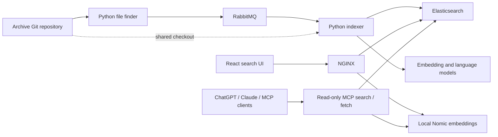

# EQ Archives Search

The frontend and indexing backend for **[search.eqarchives.org](https://search.eqarchives.org)**,
a search portal for historical EverQuest websites, mailing lists, and newsgroup
discussions preserved by EQ Archives.

This repository contains the search application, the workers that turn archived
files into searchable documents, and the frontend and embedding deployment configuration. The
archive itself lives in the separate
[eq-archives repository](https://github.com/dbsanfte/eq-archives).

## Features

- Keyword search with query syntax and optional semantic search using embeddings.
- Filters for source, content type, tags, mailing list, and dates.
- A document reader with text highlighting, citations, downloads and stable links.
- Grouped website captures with dated history and text comparisons between versions.
- Full-text previews, archive links and separately labelled OCR transcription.
- A public, read-only MCP server for researching the archive in ChatGPT, Claude and other compatible assistants, with source/date filters, paged results and source discovery.
- An archive status bar showing document count, indexing activity, and the
  frontend build's Git revision.
- Python workers for extracting text and metadata, generating embeddings, and
  optionally adding model-generated summaries, tags, and dates.

## How it works



The file finder updates a local archive checkout and queues files for processing.
Indexer workers read that shared checkout, extract content and metadata, and
write documents and vectors to Elasticsearch. Model endpoints use an
OpenAI-compatible API, including support for locally hosted models.

The React application uses Elastic Search UI and Material UI. Its search and
embedding requests go through NGINX on the same origin. NGINX supplies the
upstream credentials from runtime secret files; credentials do not belong in the
browser configuration or JavaScript bundle.

## Repository layout

| Path | Purpose |
| --- | --- |
| [`elastic-indexer-stack/frontend/`](elastic-indexer-stack/frontend/) | React application, Jest tests, and NGINX container |
| [`elastic-indexer-stack/mcp/`](elastic-indexer-stack/mcp/) | Public MCP search/fetch service, protocol tests and coverage |
| [`elastic-indexer-stack/indexer/`](elastic-indexer-stack/indexer/) | Python file finder, indexing workers, extraction handlers, and tests |
| [`elastic-indexer-stack/indexer/src/indexer/resources/`](elastic-indexer-stack/indexer/src/indexer/resources/) | Enrichment prompts and response schemas |
| [`elastic-indexer-stack/k8s-manifests/`](elastic-indexer-stack/k8s-manifests/) | Production frontend and Nomic embedding manifests, plus backend reference configuration |
| [`elastic-indexer-stack/docker-compose.yml`](elastic-indexer-stack/docker-compose.yml) | Reference Compose configuration for the services |
| [`scripts/`](scripts/) | Frontend deployment, runtime secret reconciliation, and smoke checks |
| [`.github/workflows/elastic-indexer-stack-cicd.yml`](.github/workflows/elastic-indexer-stack-cicd.yml) | Frontend pull-request checks and deployment from `master` |

## Connect through MCP

Connect a custom MCP integration to **https://search.eqarchives.org/mcp**, using
no authentication. The connector searches public archive sources and retrieves
their full extracted text, source links and provenance. Read the
[connection guide](https://search.eqarchives.org/mcp.html) for ChatGPT developer
mode, Claude setup and a sample research question. The MCP icon at the top right
of the search site opens this screen. Custom-connection availability depends on
your assistant account/workspace. Users connect directly to the public server.

The [MCP service guide](elastic-indexer-stack/mcp/README.md) covers the contract,
development, tests, resource limits and data handling. No OpenAI API key or paid
OpenAI API call is needed to operate this connector; it uses the existing archive
index and local Nomic service.

## Frontend development

Use **Node.js 22** and **Yarn Classic 1.22.22**.

```bash
git clone https://github.com/dbsanfte/eq-archives-software.git
cd eq-archives-software/elastic-indexer-stack/frontend
npm install --global yarn@1.22.22
yarn install --frozen-lockfile
yarn start
```

The development server serves the UI at `http://localhost:3000`. Search needs an
Elasticsearch index and the same-origin proxy routes described in the
[frontend guide](elastic-indexer-stack/frontend/README.md). The development
server does not configure those upstream services automatically. That guide also
shows how to build and run the NGINX container with runtime credentials.

Run the frontend tests and build with:

```bash
yarn test:ci --runInBand
yarn build
```

Jest and React Testing Library cover search behaviour, asynchronous input updates,
filters, results, configuration, and service handling. The test configuration
requires at least **90% coverage** for statements, branches, functions, and lines.

## Indexing backend

The backend has two process modes: `--file-finder` discovers work, and `--indexer`
consumes it. Running them requires:

- Python 3.13, Git, and the system `libmagic` library, as used by the
  [indexer Dockerfile](elastic-indexer-stack/indexer/Dockerfile).
- Elasticsearch 8.x with an indexing account allowed to create the index
  template and index, and read and write documents.
- RabbitMQ reachable by both processes.
- A shared, writable archive checkout, with the same `LOCAL_REPO_PATH` for both
  processes.
- An OpenAI-compatible embedding endpoint and, for enrichment, text or vision
  models. The current Elasticsearch mappings use **768-dimensional vectors**.

For a Linux development environment, install the system dependencies above, then
install the Python dependencies and run the tests:

```bash
cd elastic-indexer-stack/indexer  # from the repository root
python3.13 -m venv .venv
source .venv/bin/activate
python -m pip install -r src/indexer/requirements-dev.txt
PYTHONPATH=src python -m pytest src/indexer/test
```

The dependency set includes document conversion, OCR, and machine-learning
libraries, so installation is substantially larger than the frontend setup.
Backend tests are separate from the required frontend GitHub Actions check.

Configure the processes using environment variables:

| Variable | Purpose |
| --- | --- |
| `GIT_REPO_URL` | Archive repository to clone or update; defaults to `dbsanfte/eq-archives` on GitHub |
| `LOCAL_REPO_PATH` | Shared checkout directory; defaults to `/data/eq-archives` |
| `SPARSE_CHECKOUT_PATHS` | Optional comma-separated archive subdirectories to fetch |
| `SLEEP_INTERVAL` | Seconds between file-finder scans; defaults to `3600` |
| `RABBITMQ_HOST`, `RABBITMQ_PORT`, `RABBITMQ_QUEUE` | Queue connection; defaults to `rabbitmq`, `5672`, and `file_paths` |
| `ELASTICSEARCH_HOST`, `ELASTICSEARCH_PORT` | Elasticsearch URL without port, and separate port; defaults to `http://elasticsearch` and `9200` |
| `ELASTICSEARCH_INDEX` | Destination index; defaults to `eq-archive` |
| `OPENAI_ENDPOINT` | Model API base URL, including `/v1` |
| `OPENAI_ENDPOINT_COMPLETIONS`, `OPENAI_ENDPOINT_EMBEDDINGS` | Optional separate API base URLs overriding `OPENAI_ENDPOINT` |
| `OPENAI_EMBEDDING_MODEL_NAME` | Embedding model; use the same model for indexing and frontend queries |
| `OPENAI_TEXT_MODEL_NAME`, `OPENAI_IMAGE_MODEL_NAME` | Models used for text and image enrichment |
| `SKIP_LLM_ENRICHMENT` | Set to `true` to skip summaries, tags, and other enrichment; text indexing still generates embeddings |
| `SKIP_TEXT_FILES`, `SKIP_IMAGE_FILES`, `SKIP_OTHER_FILES` | Set individual flags to `true` to omit file types |
| `REINDEXING_ENABLED`, `REINDEXING_INTERVAL` | Enable periodic reindexing and set the interval in seconds |
| `LOG_LEVEL` | Logging level; defaults to `INFO` |

Mount indexing credentials at `/run/secrets/es_username`,
`/run/secrets/es_password`, and `/run/secrets/openai_api_key`. For local processes,
`ELASTICSEARCH_USERNAME`, `ELASTICSEARCH_PASSWORD`, and `OPENAI_API_KEY` can instead
be supplied through the environment. Keep their values out of Git and shell
history. Both modes initialize the model clients, so configure the API base URLs
and key for the file finder as well as the indexer.

With dependencies and configuration in place, run each mode in a separate
terminal from `elastic-indexer-stack/indexer`:

```bash
python src/main.py --file-finder
```

```bash
python src/main.py --indexer
```

Index mappings are defined in
[`es_manager.py`](elastic-indexer-stack/indexer/src/indexer/es_manager.py).
The template matches `eq-archive*`; use a matching index name or adapt the
template. Keep the frontend's `indexName`, the NGINX `ELASTICSEARCH_INDEX`, and
the index or alias containing the indexed documents consistent.

The existing Compose file is a deployment reference with environment-specific
addresses and zero replicas for the backend services. Adapt the addresses,
secrets, index names, and replica counts before using it for your own stack.
Elasticsearch and enrichment model servers must be provisioned separately.
The production frontend deployment below provisions its own Nomic embedding service.

## Deployment

The frontend, read-only MCP connector and local **llama.cpp / Nomic Embed v1.5 Q8_0** service deploy
automatically from `master` to the production **k3s** cluster. Nomic uses eqvm's
Radeon iGPU through Vulkan and returns normalized 768-dimensional vectors.
The model is pinned to a Hugging Face revision and SHA-256, downloaded into a
persistent cache, and served only inside the cluster. NGINX forwards the public
`/openai/v1/embeddings` route with its runtime API key. The frontend adds Nomic's
`search_query:` prefix; this instance accepts up to 512 tokens per input.

Pull requests run tests, enforce coverage, build the frontend and MCP containers,
and exercise the real Nomic server on CPU through both services on a GitHub-hosted
runner. Only `master` publishes images and deploys through the VM's self-hosted runner.

Deployments use immutable image digests and rolling readiness checks. Reapplying
the same image, configuration, and secrets does not restart the pods. The
workflow verifies GPU offload and embeddings before updating the frontend, then
checks a vector-only search through the public proxy. Archive ingestion,
Elasticsearch, and enrichment model services have separate lifecycles.

See the [deployment guide](elastic-indexer-stack/k8s-manifests/README.md) for
prerequisites, Actions secrets, manifests, verification, and rollback.

## Contributing

Open an [issue](https://github.com/dbsanfte/eq-archives-software/issues) for bugs
or proposed changes, and submit pull requests against `master`. Include a
regression test for every bug fix, using browser tests for layout and stacking
issues, and update the relevant documentation. The protected branch requires
an up-to-date PR and the passing `Test and build frontend` check.

Use placeholders in examples. Keep credentials in local ignored files, runtime
secret mounts, or GitHub Actions secrets. Browser configuration is public and
must contain only non-secret settings.

## License

The EQ Archives Search software is licensed under the **GNU Affero General
Public License, version 3 only** (`AGPL-3.0-only`). See [LICENSE](LICENSE) for the
full terms.

The frontend includes code adapted from Elastic's App Search Reference UI.
Its original Apache-2.0 license and copyright notice are preserved in the
[third-party notices](elastic-indexer-stack/frontend/NOTICE.txt) and
[upstream license](elastic-indexer-stack/frontend/licenses/Elastic-Apache-2.0.txt).
Third-party dependencies retain their own licenses.

This software license does not grant rights to the archived content, EverQuest
names, logos, or other third-party artwork; those remain subject to their
respective rights and terms.
